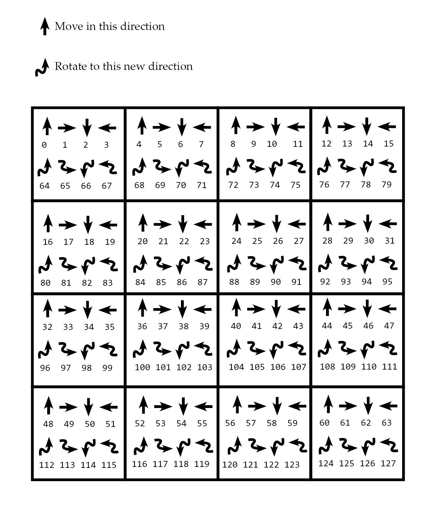

# Roomba
An AlphaZero Implementation for Roomba, an upcoming abstract strategy game. This is a fork of Kiwimaru's implementation of Boop as there seemed to be some similarities in game play. 

The quick description of this game is that each player has 3 pieces on a 4x4 board. Pieces have a direction they are facing (up,right,down,left) which in code is represented by numbers (1,2,3,4)  There are two players, so one player's pieces are demarked by negative numbers but the absolute value still represents the directions. 

On your turn you can either move or rotate a piece.  

To represent the board state with a binary array, all the possible moves are listed out on a cheatsheet from 0 to 63.  Rotating a piece is represented by integers 64 to 127.

The purpose of this project is to be testing different rulesets variations such as being able to take a total of 3 "moves" on your turn, the board size, the number of pieces, the win condition, etc. 
